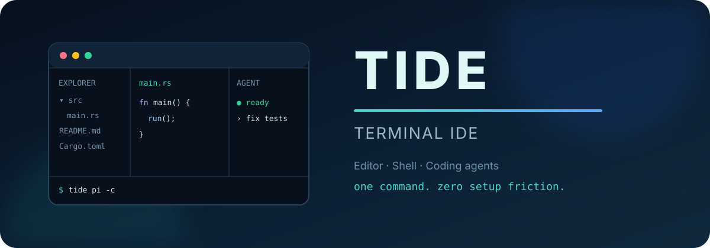
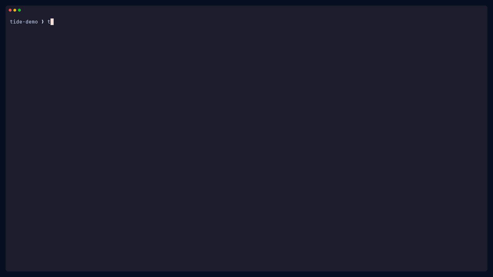

<p align="center">
  
</p>

<p align="center">
  <strong>A focused terminal workspace for code, shells, and AI agents.</strong><br>
  Launch the whole development environment with one command.
</p>

<p align="center">
  <a href="https://github.com/nasazzam/tide/actions/workflows/ci.yml"></a>
  <a href="https://github.com/nasazzam/tide/releases"></a>
  <a href="LICENSE"></a>
  <a href="https://github.com/nasazzam/tide/stargazers"></a>
  
  
</p>

<p align="center">
  <a href="assets/tide-demo.mp4">
    
  </a>
  <br>
  <sub>Animated preview · click to open the MP4</sub>
</p>

---

## Table of contents

- [Overview](#overview)
- [Installation](#installation)
  - [Quick install](#quick-install)
  - [Omarchy](#omarchy)
  - [Homebrew](#homebrew)
  - [Winget](#winget)
  - [Build from source](#build-from-source)
  - [System dependencies](#system-dependencies)
  - [Windows and WSL](#windows-and-wsl)
- [Usage](#usage)
  - [Launch one agent](#launch-one-agent)
  - [Pass agent arguments](#pass-agent-arguments)
  - [Launch multiple agents](#launch-multiple-agents)
  - [Open another project](#open-another-project)
  - [Editor-only mode](#editor-only-mode)
  - [Restore named workspaces](#restore-named-workspaces)
  - [Project configuration](#project-configuration)
  - [CLI reference](#cli-reference)
- [Feature guide](docs/features.md)
- [Keyboard reference](#keyboard-reference)
- [Platform support](#platform-support)
- [Development](#development)
- [Star history](#star-history)
- [Contributing](#contributing)
- [Acknowledgements](#acknowledgements)
- [License](#license)

## Overview

Coding agents are most useful beside the code—not hidden behind a separate
window. TIDE creates a complete terminal development workspace around the
current project.

## Installation

### Quick install

```bash
curl -fsSL https://raw.githubusercontent.com/nasazzam/tide/main/install.sh | bash
```

The installer detects the operating system and architecture, verifies the
release checksum when available, and installs into `~/.local/bin`. If no
prebuilt artifact exists, it falls back to a Cargo source build.

> Prefer to inspect scripts before executing them? Download first:
>
> ```bash
> curl -fsSLO https://raw.githubusercontent.com/nasazzam/tide/main/install.sh
> less install.sh
> bash install.sh
> ```

### Omarchy

Install TIDE as an Omarchy terminal application, including its launcher entry,
icon, and tmux dependency:

```bash
curl -fsSL https://raw.githubusercontent.com/nasazzam/tide/main/packaging/omarchy/install.sh | bash
```

TIDE then appears in the Omarchy application launcher. Open it there or run:

```bash
omarchy launch or focus tui --app-id=org.tide.TIDE tide
```

An optional Omarchy Shell bar widget is included in this repository. It adds a
TIDE button to the bar:

```bash
omarchy plugin add https://github.com/nasazzam/tide.git --enable
```

Plugins execute inside `omarchy-shell`; review `manifest.json` and
`TideWidget.qml` before enabling third-party code. The package can also be built
locally with Arch's package tools:

```bash
git clone https://github.com/nasazzam/tide.git
cd tide/packaging/arch
makepkg -si
```

### Homebrew

The repository is a self-contained Homebrew tap for Intel and Apple Silicon
macOS:

```bash
brew tap nasazzam/tide https://github.com/nasazzam/tide
brew install nasazzam/tide/tide
```

### Winget

A multi-file Winget portable-package manifest for the native Windows editor is
maintained under [`packaging/winget`](packaging/winget). After it is published
to the Winget community repository, install it with:

```powershell
winget install TIDE.TerminalIDE
```

Use WSL instead when you want TIDE's complete tmux workspace.

### Build from source

<details open>
<summary>Clone, build, and install locally</summary>

```bash
git clone https://github.com/nasazzam/tide.git
cd tide
./scripts/install.sh
```

Use another installation prefix if needed:

```bash
./scripts/install.sh --prefix /usr/local
```

</details>

### System dependencies

The full workspace requires **tmux 3.2+**. Building from source requires
**Rust 1.88+**. Git, [Hunk](https://hunk.dev) diff review, and the preview
utilities are optional.

| Platform | Install dependencies |
|---|---|
| Arch / Omarchy | `sudo pacman -S rust tmux git poppler imagemagick ffmpegthumbnailer` |
| Debian / Ubuntu | `sudo apt install cargo tmux git poppler-utils imagemagick ffmpegthumbnailer` |
| Fedora | `sudo dnf install cargo tmux git poppler-utils ImageMagick ffmpegthumbnailer` |
| macOS | `brew install rust tmux git poppler imagemagick ffmpegthumbnailer` |

### Windows and WSL

Use TIDE through **WSL** for the complete workspace:

```powershell
wsl bash -lc 'curl -fsSL https://raw.githubusercontent.com/nasazzam/tide/main/install.sh | bash'
wsl tide pi -c
```

The editor also builds natively on Windows, but tmux workspace orchestration is
currently Unix/WSL-only. See [`scripts/install.ps1`](scripts/install.ps1) for a
native editor installation.

## Usage

### Launch one agent

Pass any interactive CLI as the first positional argument:

```bash
tide pi
tide codex
tide claude
tide opencode
```

Running `tide` without an agent still creates the editor, project shell, and an
empty pane ready for a command.

### Pass agent arguments

Arguments are forwarded directly—quotes around the complete command are not
needed:

```bash
tide pi -c
tide codex --full-auto
tide claude --continue
```

### Launch multiple agents

Separate complete commands with `::`. TIDE gives each agent its own pane:

```bash
tide pi -c :: claude --continue
tide codex --full-auto :: opencode --auto
```

### Open another project

Use `--project` before the agent command:

```bash
tide --project ~/code/my-app pi
```

### Editor-only mode

Skip tmux and agent panes when you only need the native editor:

```bash
tide --editor .
tide --editor ~/code/my-app
```

### Restore named workspaces

Use a stable name to reconnect to an existing TIDE tmux workspace. If it does
not exist yet, TIDE creates it:

```bash
tide --resume tide-my-app pi -c
tide --list-sessions
```

Named restoration preserves editor tabs, agents, shells, and pane state because
the original processes remain in the detached tmux session.

### Project configuration

Copy [`.tide.toml.example`](.tide.toml.example) to `.tide.toml` in a project.
Configuration can select the workspace layout and pane sizes, enable named
restoration, set Explorer defaults, and choose a language server. Command-line
options override workspace settings.

```toml
[workspace]
layout = "agents-left"
shell_size = 18
agent_size = 35
session = "project"
restore = true

[editor]
explorer_width = 24
show_hidden = false

[lsp]
command = ["rust-analyzer"]
```

### CLI reference

TIDE options must appear before the agent command. Every argument after the
agent name is forwarded unchanged.

<details>
<summary>Show all command-line options</summary>

```text
Usage:
  tide [tide-options] [agent [agent-args...]]
  tide [tide-options] agent1 [args...] :: agent2 [args...]
  tide --editor [path]

Options:
  -p, --project PATH           Project directory
  -s, --session-name NAME      tmux session name
  -r, --resume NAME            Restore or create a named workspace
      --list-sessions          List restorable TIDE sessions
      --layout VALUE           classic, agents-left, or agents-bottom
      --shell-size PERCENT     Project-shell height
      --agent-size PERCENT     Agent area size
      --editor [PATH]          Open only the native editor
      --no-attach              Create without attaching
      --image-protocol VALUE   auto, sixel, kitty, iterm2, halfblocks
  -h, --help                   Show help
  -V, --version                Show version
```

</details>

## Feature guide

Detailed feature documentation is available in the
**[TIDE feature guide](docs/features.md)**.

## Keyboard reference

### Global

| Key | Action |
|---|---|
| <kbd>Ctrl</kbd>+<kbd>E</kbd> | Switch Explorer / Editor focus |
| <kbd>Ctrl</kbd>+<kbd>P</kbd> | Quick Open; start with `%` for content search |
| <kbd>Ctrl</kbd>+<kbd>D</kbd> | Open a live Hunk diff review |
| <kbd>Ctrl</kbd>+<kbd>S</kbd> | Save |
| <kbd>Ctrl</kbd>+<kbd>Q</kbd> | Quit safely |
| <kbd>Ctrl</kbd>+<kbd>W</kbd> | Close active file |
| <kbd>Ctrl</kbd>+<kbd>R</kbd> | Reload from disk / resolve conflict |
| <kbd>Alt</kbd>+<kbd>1…9</kbd> | Switch tabs |
| <kbd>Ctrl</kbd>+<kbd>Space</kbd> | Request LSP completion |
| <kbd>F5</kbd> | Refresh project and Git state |

### Editor and Explorer

| Context | Keys |
|---|---|
| Editor | Arrows, Home/End, Page Up/Down, `Ctrl+Z`, `Ctrl+Y`, Tab |
| Explorer | Up/Down or `j/k`, Enter/Right to open, Left/Backspace to collapse |
| Explorer | `Ctrl+H` toggles hidden files; `[` and `]` scroll deep trees |
| Explorer | `n` new file, `N` new directory, `r` rename, `m` move, `d` delete |
| Quick Open | Up/Down selects, Enter opens, Escape closes |
| Mouse | Select text, scroll panes, open files, switch and close tabs, open Δ DIFF |

## Development

```bash
cargo build
cargo run --bin tide-editor -- .
make check     # fmt + clippy + tests + launcher checks
make build     # optimized release binary
make install
```

## Platform support

| Platform | Native editor | Full workspace |
|---|:---:|:---:|
| Linux | ✓ | ✓ |
| macOS | ✓ | ✓ |
| BSD | expected | ✓ |
| Windows | ✓ | — |
| Windows + WSL | ✓ | ✓ |

CI validates Linux, macOS, and native Windows builds. Prebuilt artifacts are
published from tagged releases.

## Star history

<a href="https://www.star-history.com/#nasazzam/tide&Date">
  <picture>
    <source media="(prefers-color-scheme: dark)" srcset="https://api.star-history.com/svg?repos=nasazzam/tide&type=Date&theme=dark">
    <source media="(prefers-color-scheme: light)" srcset="https://api.star-history.com/svg?repos=nasazzam/tide&type=Date">
    
  </picture>
</a>

If you find TIDE useful, please consider
[giving the project a star](https://github.com/nasazzam/tide). It helps more
developers discover the project and supports its continued development.

## Contributing

Contributions are welcome. Read [CONTRIBUTING.md](CONTRIBUTING.md) before
opening a pull request.

## Acknowledgements

TIDE's original workspace concept was inspired by
[Omarchy](https://omarchy.org/) and its polished, terminal-first developer
experience.

TIDE is built with [Rust](https://www.rust-lang.org/),
[Ratatui](https://ratatui.rs/), [Crossterm](https://github.com/crossterm-rs/crossterm),
[Syntect](https://github.com/trishume/syntect),
[ratatui-image](https://github.com/benjajaja/ratatui-image), and
[tmux](https://github.com/tmux/tmux).

## License

Released under the [MIT License](LICENSE). © TIDE contributors.
